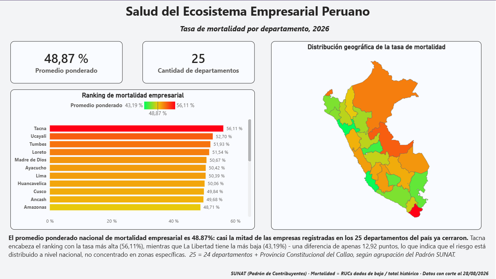
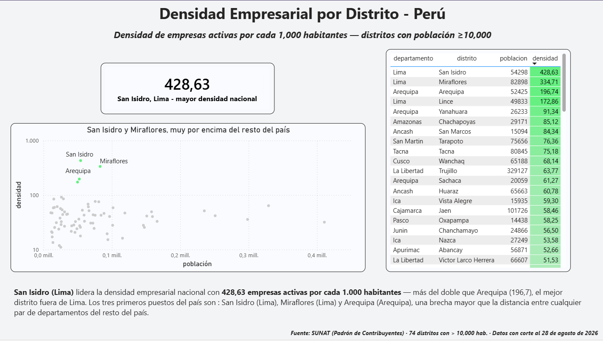
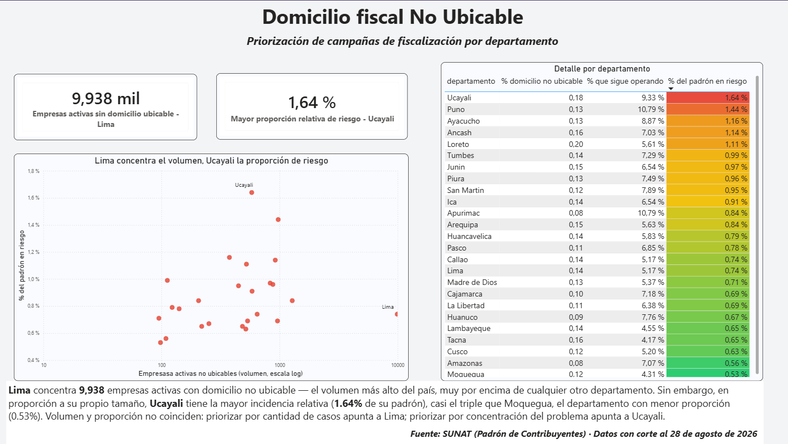
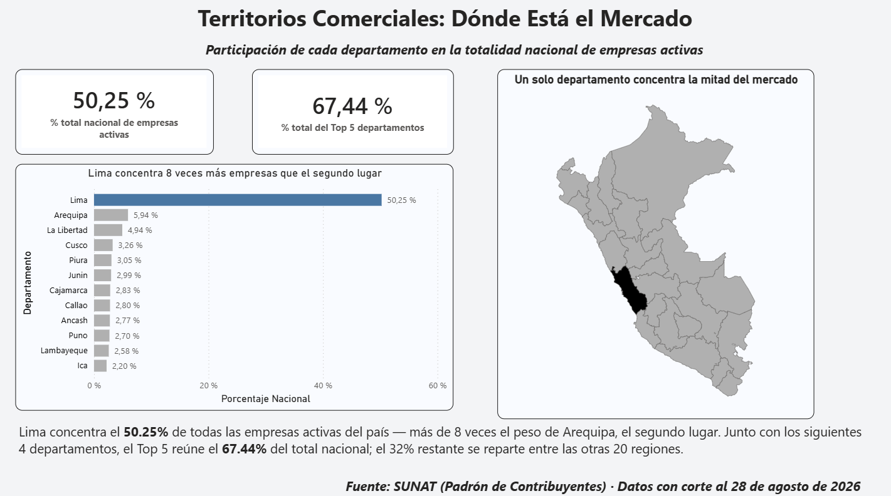

# Análisis del Padrón RUC de SUNAT con SQL y Power BI

Cuatro preguntas de negocio resueltas con SQL avanzado en PostgreSQL sobre el Padrón RUC de SUNAT (18.3 millones de contribuyentes peruanos), cruzado con datos geográficos del INEI y presentado en un dashboard de Power BI.

## Hallazgos principales

- El **48.87%** de los RUCs con ubicación válida (~2.7 millones) ya fue dado de baja, y el rango entre departamentos es de solo 13 puntos: la mortalidad empresarial es un fenómeno nacional, no de regiones puntuales.
- **Lima concentra el 50.25%** de las empresas activas registradas con ubicación válida. El segundo lugar, Arequipa, tiene 5.94%.
- Lima ocupa 3 de los 4 primeros puestos en densidad de empresas activas por cada 1,000 habitantes (San Isidro lidera con 428.6).
- Más del 90% de los RUCs con domicilio no ubicable ya están dados de baja; el caso urgente para fiscalización es el resto, y ahí Ucayali, Puno y Ayacucho tienen la mayor proporción relativa.

## Preguntas de negocio

| # | Pregunta | Stakeholder | Técnica SQL | Query | Insight |
|---|----------|-------------|-------------|-------|---------|
| 1 | ¿Qué departamentos tienen mayor mortalidad empresarial? | Riesgo crediticio | CTEs encadenadas, `FILTER`, `ROW_NUMBER`, `CROSS JOIN` con promedio ponderado | [SQL](sql/01_mortalidad_departamento.sql) | [Ver](insights/01_mortalidad_departamento.md) |
| 2 | ¿Qué distritos tienen mayor densidad de empresas activas por cada 1,000 habitantes? | Expansión retail | `ROW_NUMBER() OVER (PARTITION BY ...)` para top 3 por departamento | [SQL](sql/02_densidad_distrital.sql) | [Ver](insights/02_densidad_distrital.md) |
| 3 | ¿Dónde es más urgente actualizar domicilios fiscales? | Fiscalización (SUNAT) | Varios `COUNT(*) FILTER` cruzando dos condiciones, `NULLIF` | [SQL](sql/03_condicion_domicilio.sql) | [Ver](insights/03_condicion_domicilio.md) |
| 4 | ¿Cómo se concentran las empresas activas por departamento? | Ventas B2B | `SUM() OVER ()` sin partición, porcentaje sobre el total nacional | [SQL](sql/04_top_departamentos_activas.sql) | [Ver](insights/04_top_departamentos_activas.md) |

## Dashboard

[Ver dashboard interactivo en Power BI](https://app.powerbi.com/view?r=eyJrIjoiMTE4OWRjMDAtMGMwYy00NTM1LThiNjItNjhkZTg2YzU2YTgzIiwidCI6ImE4MDFlMWIwLWI3OGQtNGNjNS1hYWIyLWYzMmJhM2JjYWU3YiIsImMiOjR9)

### Mortalidad empresarial por departamento


### Densidad de empresas activas por distrito


### Domicilio no ubicable


### Concentración de empresas activas por departamento


## Stack

PostgreSQL · SQL avanzado (CTEs, window functions, `FILTER`, subconsultas) · Python (limpieza de datos) · Power BI

## Pipeline

```
Padrón RUC (SUNAT, .txt) ──► Limpieza con Python ──► PostgreSQL ──► Consultas SQL ──► Power BI
Ubigeo (INEI, .csv)      ──────────────────────────►
```

## Fuentes de datos

- Padrón Reducido RUC, SUNAT: https://www.sunat.gob.pe/descargaPRR/mrc137_padron_reducido.html (datos con corte al 28/09/2026)
- Ubigeo, INEI, vía el repositorio geodir/ubigeo-peru: https://github.com/geodir/ubigeo-peru

Los datos crudos no se incluyen en este repositorio. Detalle en [data/README.md](data/README.md).

## Alcance de los datos

El padrón completo tiene 18.3 millones de registros, pero 15.6 millones no tienen dirección fiscal estructurada (`ubigeo = '-'`). Los análisis geográficos usan los **2,698,257 RUCs con ubicación válida**.

## Limitaciones

- El padrón es una foto acumulada, sin fecha de alta ni de baja por RUC. Las tasas de mortalidad son históricas, no anuales.
- Contar RUCs no mide el tamaño ni la facturación de las empresas.
- El ubigeo corresponde al domicilio fiscal, que puede no coincidir con el lugar donde opera la empresa.
- Solo cerca del 15% de los RUCs (2.7 de 18.3 millones) tiene ubicación válida, así que los resultados geográficos describen ese subconjunto.
- El criterio de "activo" cambia según la pregunta (`NOT LIKE 'BAJA%'` en las preguntas 1 y 3, `= 'ACTIVO'` en la 2 y la 4), según el objetivo de cada stakeholder.
- SUNAT actualiza el padrón con frecuencia, por lo que una descarga posterior puede dar cifras ligeramente distintas.

## Problemas técnicos resueltos

La carga del padrón requirió resolver un separador sobrante en cada línea, comillas sueltas que rompían el parser, filas con columnas de más y un encoding Latin-1 que no es UTF-8. El detalle está en [docs/informe_tecnico.md](docs/informe_tecnico.md).


## Autor

Yamil Nair Solis Diaz, ingeniero de sistemas e informática.
[LinkedIn](https://www.linkedin.com/in/yamilnsolisdiaz-data/)
